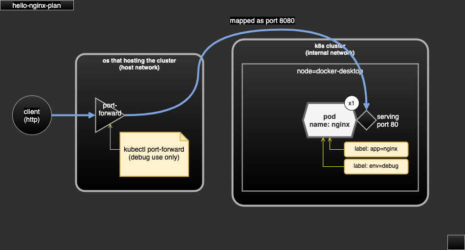

# hello-nginx-plan

- hello world deployment (most basic)
- dependency:
  - this demo only use public docker images.
- serving:
  - single nginx (http server) at port 80.
  - no expose to external network.

## Demo scope

- hello world (simple) k8s deployment (and pod)
- access Pod using debug command `port-forward`.

## test

```sh
kubectl create namespace hello-world
kubectl apply -f plan.yaml
kubectl -n hello-world get pods -l "app=nginx,env=debug"

# assume the pod name is hello-world-7cc8889b65-r89zm
kubectl -n hello-world port-forward hello-world-7cc8889b65-r89zm 8080:80
curl -v http://127.0.0.1:8080/
```

## diagram



