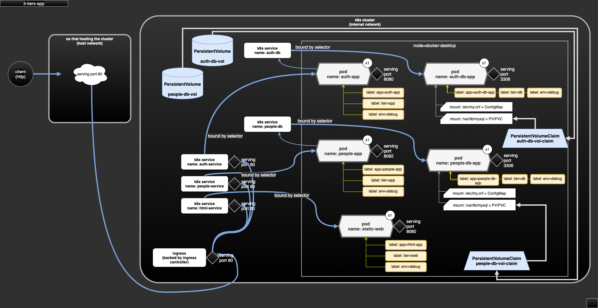

# case-3-tiers-app

- small 3 tiers architecture app (web/app/db).
- dependency:
  - database(mysql) container need to be populated (or restored), refer to section "Database Restoration".
  - require docker image `people-service:1.0`.
  - require ingress controller `ingress-nginx` (v4.0.6).
  - require Kubernetes metrics server (v0.5.1).
- serving:
  - http at port 80 via ingress.

## Docker image downloads

- docker image file could be downloaded (TODO).
- file name convention: for an app/service called `foo` with tag/version `1.0`, the file name will be `img-foo-1.0.tar`.

## Database Restoration

- Restore with db dump file.
- db dump file could be downloaded at: http://somewhere/TODO

## Demo scope

- define app/pod for app.
- define app/pod to serve database (mysql).
- define app/pod for static web (html).
- define service to serve static web, app and database.
- define ingress as entry of web and API gateway.

## test

```sh
kubectl create namespace hello-world
kubectl apply -R -f case-3-tiers-app-plan

# use curl, or visit the web via browser
curl -v http://127.0.0.1/
```

## diagram



