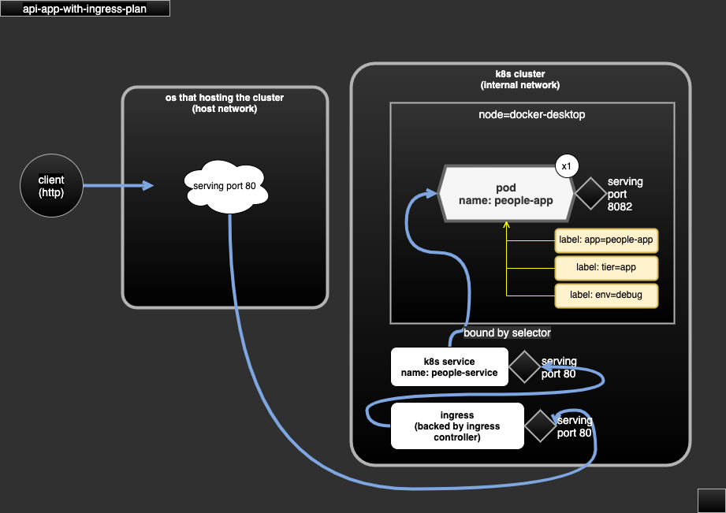

# case-api-app-with-ingress

- API app (http) exposed via ingress.
- dependency:
  - require docker image `people-service:1.0`.
  - require ingress controller `ingress-nginx` (v4.0.6).
  - require Kubernetes metrics server (v0.5.1).
- serving:
  - http at port 80 via ingress.

## Docker image downloads

- docker image file could be downloaded (TODO).
- file name convention: for an app/service called `foo` with tag/version `1.0`, the file name will be `img-foo-1.0.tar`.

## Demo scope

- define app/pod for app.
- mount config(ConfigMap) as app config file (application.yaml).
- mount config(ConfigMap) as logger config file (logback.xml).
- define service to serve app.
- define ingress as API gateway.

## test

```sh
kubectl create namespace hello-world
kubectl apply -R -f case-api-app-with-ingress-plan

# curl to invoke remapped endpoint like this
curl -v http://127.0.0.1/api/people-service/1.0/about
```

## diagram



