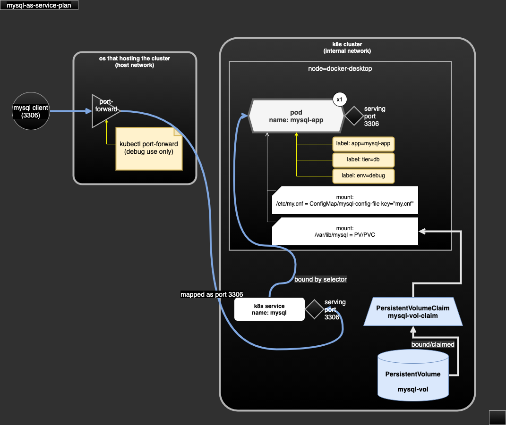

# mysql-as-service

- serving mysql as k8s service.
- dependency:
  - this demo only use public docker images.
  - require Kubernetes metrics server (v0.5.1).
- serving:
  - single mysql at port 3306.
  - no expose to external network.

## Demo scope

- define app/pod to serve database (mysql).
- define environment variable of the container by values defined in config(ConfigMap).
- mount config(ConfigMap) as text file for containers.
- mount volume (PersistentVolume/PersistentVolumeClaim) as directory for containers to store data files.

## test

```sh
kubectl create namespace hello-world
kubectl apply -R -f case-mysql-as-service-plan
kubectl -n hello-world get pods -l "app=mysql-app,env=debug"

# assume the pod name is mysql-as-service-75f6f758f7-6zs7w

# create db user with external access permission
kubectl -n hello-world exec mysql-as-service-75f6f758f7-6zs7w \
  -- mysql -uroot -ppass1234 -e \
  "CREATE USER 'yu'@'%' IDENTIFIED BY 'pass1234';"
kubectl -n hello-world exec mysql-as-service-75f6f758f7-6zs7w \
  -- mysql -uroot -ppass1234 -e \
  "GRANT ALL PRIVILEGES ON *.* TO 'yu'@'%';"
kubectl -n hello-world exec mysql-as-service-75f6f758f7-6zs7w \
  -- mysql -uroot -ppass1234 -e \
  "FLUSH PRIVILEGES;"

# proxy the port and you could connect to localhost:3306
# with user name 'yu'
# password 'pass1234'
kubectl -n hello-world port-forward service/mysql 3306
```

## diagram



