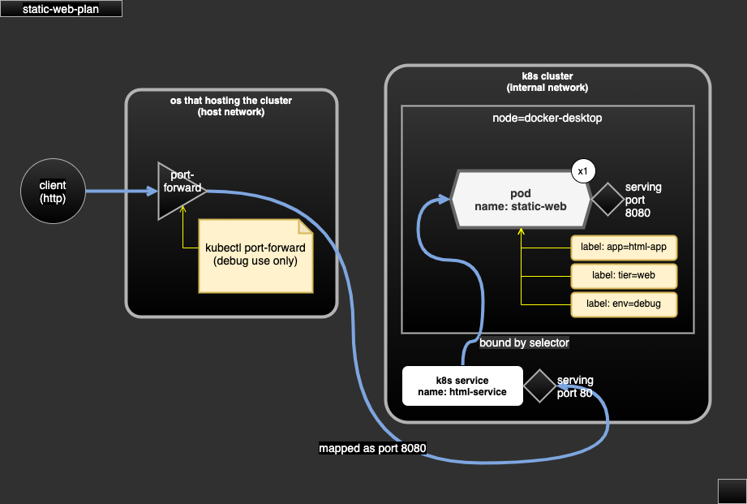

# case-static-web

- serving static web.
- dependency:
  - require docker image `gui-web-vue:1.0`.
  - require Kubernetes metrics server (v0.5.1).
- serving:
  - single http server at port 80.
  - no expose to external network.

## Docker image downloads

- docker image file could be downloaded (TODO).
- file name convention: for an app/service called `foo` with tag/version `1.0`, the file name will be `img-foo-1.0.tar`.

## Demo scope

- define app/pod to serve static web (html).

## test

```sh
kubectl create namespace hello-world
kubectl apply -R -f case-static-web-plan
kubectl -n hello-world port-forward service/html-service 8080:80

# use curl, or visit the web via browser
curl -v http://127.0.0.1:8080/
```

## diagram



