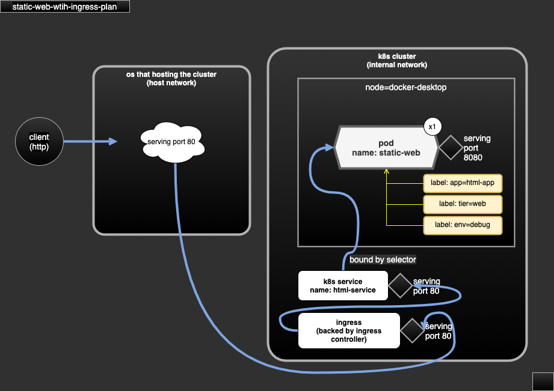

# case-static-web-with-ingress

- static web exposed via ingress.
- dependency:
  - require docker image `gui-web-vue:1.0`.
  - require ingress controller `ingress-nginx` (v4.0.6).
- serving:
  - http at port 80 via ingress.

## Docker image downloads

- docker image file could be downloaded (TODO).
- file name convention: for an app/service called `foo` with tag/version `1.0`, the file name will be `img-foo-1.0.tar`.

## Demo scope

- define app/pod to serve static web (html).
- define ingress as entry of web.

## test

```sh
kubectl create namespace hello-world
kubectl apply -R -f case-static-web-with-ingress-plan

# use curl, or visit the web via browser
curl -v http://127.0.0.1/
```

## diagram



